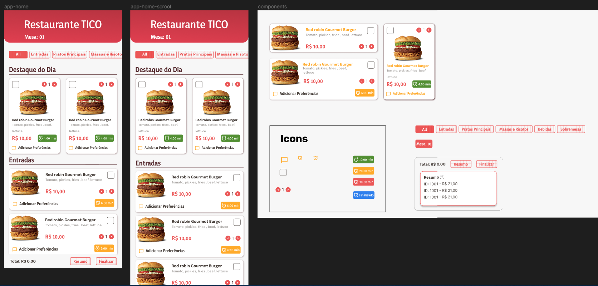

# Write Code - Cardápio

## Tecnologias e Recursos
- Kotlin
- Android Nativo
- IDE Andoid Studio

## Protótipo do Projeto
- [Layout Figma](https://www.figma.com/file/py6KoE82DMHnx0uFjdHfex/write-code-irede?type=design&node-id=0%3A1&mode=design&t=7DVdDEAnn91dGl2C-1)

    <apan align="center">
      
    </apan>

## Demonstração 

    <apan align="center">
      
    </apan>    
    <apan align="center">
      
    </apan>

## Sobre o projeto
- O cliente faz o pedido através do aplicativo que o
estabelecimento fornece, sendo a internet do local com acesso
gratuito e a senha o número da mesa em que o cliente se
encontra;
- O aplicativo contempla vários pratos divididos em seções:
entradas, pratos principais, bebidas e sobremesas;
- O aplicativo cuja finalidade é o cardápio online com base nas
requisições do usuário, sendo estas: a soma dos pratos
selecionados através da marcação ou através da desmarcação
realiza-se a subtração (checkbox);
- Os pratos devem ter um tempo médio para que o cliente possa
escolher entre aqueles que saem rápido ou os que saem com o
tempo maior, isso deve estar claro e atualizado no cardápio;
- Importante ter um campo de texto para que o cliente possa
digitar suas preferências em relação aos pratos;
- Ao finalizar o pedido, o cliente os confirma através de um botão
ao final, denominado “Realizar pedido”;
